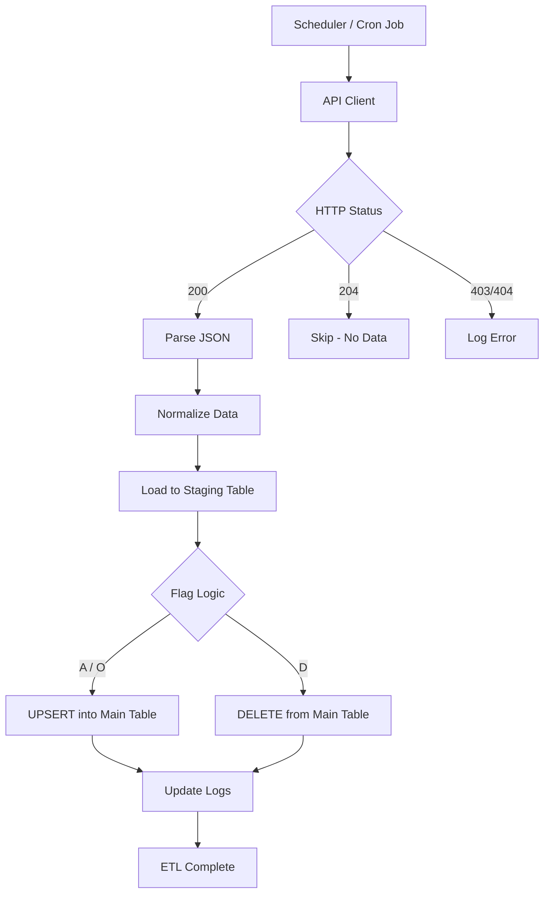

# 🚀 API-Based ETL Ingestion Pipeline (Accord Data Feed)
## 📌 Overview

This system is designed to **ingest financial data from Accord API**, process it efficiently, and store it in PostgreSQL using a **high-performance ETL pipeline**.

Instead of direct inserts, it uses:

👉 **Staging + Bulk COPY + Merge Strategy**

This ensures:

* High performance
* Data consistency
* Fault tolerance
* Auditability

---

## 🏗️ Architecture



---

## 📂 Project Structure

```plaintext
api_ingestion_service/
├── app/
│   ├── main.py                # Entry point
│   ├── scheduler.py           # Cron / APScheduler logic
│   ├── accord_client.py       # API calling logic
│   ├── normalizer.py          # JSON → DataFrame conversion
│   ├── staging_loader.py      # COPY into staging
│   ├── merge_service.py       # UPSERT + DELETE logic
│   ├── ingestion_log.py       # Logging + tracking
│   ├── config.py              # Env configs
│   └── db.py                  # DB connection
│
├── sql/
│   ├── staging.sql
│   ├── merge_queries.sql
│   └── indexes.sql
│
├── docker-compose.yml
├── Dockerfile
├── requirements.txt
└── README.md
```

---

## 🔄 Data Flow

### 1. API Request

```http
GET /RawData/GetRawDataJSON
?filename=Company_master
&date=ddMMyyyy
&section=Fundamental
&token=YOUR_TOKEN
```

---

### 2. API Response Handling

| Status Code | Meaning            | Action       |
| ----------- | ------------------ | ------------ |
| 200         | Data Available     | Process      |
| 204         | No Update          | Skip         |
| 403         | IP Not Whitelisted | Fail + Alert |
| 404         | Wrong Endpoint     | Fix config   |

---

## 📊 Data Format

API returns:

```json
{
  "Table": [
    {
      "FINCODE": 324868,
      "DIRNAME": "John Doe",
      "FLAG": "A"
    }
  ]
}
```

---

## 🔧 Processing Steps

### Step 1: Normalize JSON

* Convert keys → lowercase
* Handle null values
* Ensure `flag` exists

---

### Step 2: Load into Staging Table

```sql
CREATE TEMP TABLE staging (LIKE target INCLUDING DEFAULTS);
```

Then:

```python
COPY staging FROM STDIN WITH CSV
```

---

### Step 3: Apply Business Logic

### 🔹 Flag-Based Processing

| Flag | Operation |
| ---- | --------- |
| A    | Insert    |
| O    | Update    |
| D    | Delete    |

---

### 🔹 UPSERT Logic

```sql
INSERT INTO target_table (...)
SELECT ...
FROM staging
WHERE flag IN ('A', 'O')
ON CONFLICT (primary_key)
DO UPDATE SET ...
```

---

### 🔹 DELETE Logic

```sql
DELETE FROM target_table t
USING staging s
WHERE t.pk = s.pk
AND s.flag = 'D';
```

---

## 🗂️ Feed Categories

### Master Data (Low Frequency)

* Company_master
* Industrymaster
* Housemaster

### Transactional / Frequent

* Board
* Financials
* Results
* Shareholding

---

## ⏱️ Scheduling Strategy

| Data Type  | Frequency  |
| ---------- | ---------- |
| Master     | Daily      |
| Financials | End of Day |
| Results    | Hourly     |
| Prices     | Daily      |

---

## 🧾 Logging & Monitoring

### Table: `ingestion_runs`

```sql
CREATE TABLE ingestion_runs (
    id BIGSERIAL PRIMARY KEY,
    feed_name TEXT,
    requested_date DATE,
    status TEXT,
    http_status INT,
    rows_received INT,
    rows_upserted INT,
    rows_deleted INT,
    error_message TEXT,
    started_at TIMESTAMP,
    finished_at TIMESTAMP
);
```

---

## 📦 Raw Data Archival (Optional)

```sql
CREATE TABLE raw_api_payloads (
    id BIGSERIAL PRIMARY KEY,
    feed_name TEXT,
    payload JSONB,
    created_at TIMESTAMP DEFAULT now()
);
```

---

## ⚠️ Important Considerations

### 1. Foreign Key Dependencies

Load order matters:

```text
Company_master → must load first
↓
Dependent tables (Board, Address, Financials)
```

---

### 2. NULL Handling

Convert:

```python
<NA> → NULL
None → ""
```

---

### 3. Data Integrity

* Some identifiers may not be unique
* Validate before inserting
* Use composite keys if required

---

### 4. Idempotency

* Re-running ETL should NOT duplicate data
* Use UPSERT logic always

---

## 🚀 Running the Pipeline

### Using Docker

```bash
docker compose up --build
```

---

### Manual Run

```bash
python app/main.py
```

---

## 🔍 Debugging

Enable debug logs:

```python
print(df.columns)
print(copy_columns)
```

---

## 📈 Performance Optimization

* Use `COPY` instead of INSERT
* Batch processing (1000–5000 rows)
* Index primary keys
* Avoid row-by-row operations

---

## 🧠 Key Design Principles

* **Database does heavy work (not Python)**
* **Bulk operations > row operations**
* **Staging layer = safety layer**
* **Logs = observability**

---

## 🎯 Future Enhancements

* Parallel ingestion per feed
* Retry mechanism for failed APIs
* Kafka-based streaming ingestion
* Real-time dashboard (ETL status)
* Data validation engine

---

## 💡 Summary

This system transforms:

```text
API JSON → Clean Data → Staging → Merge → Production Tables
```

With:

* High speed ⚡
* Data safety 🔒
* Scalability 📈
* Observability 👀
